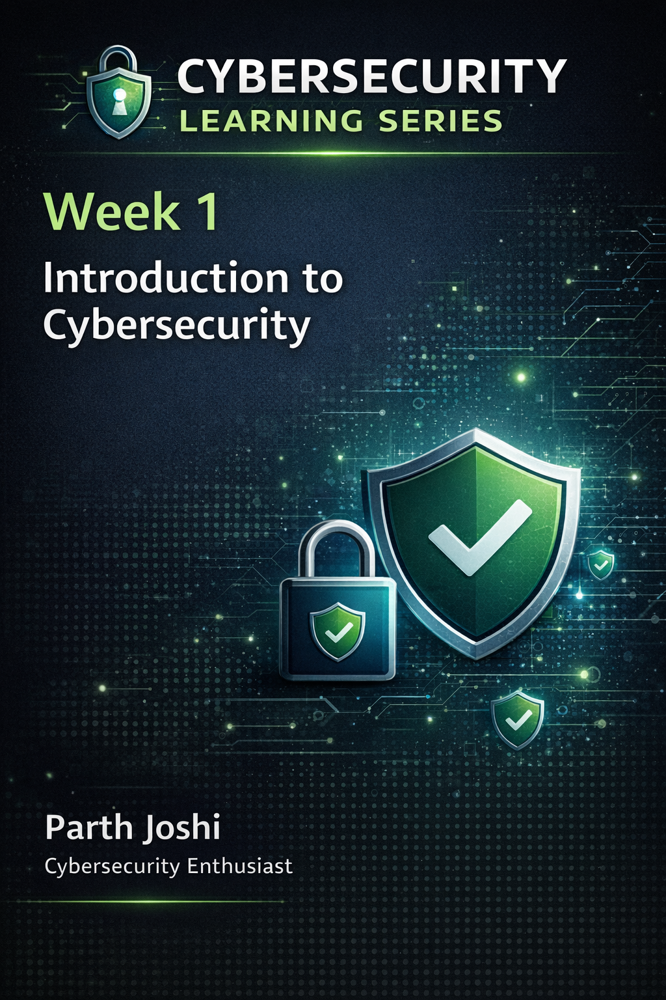
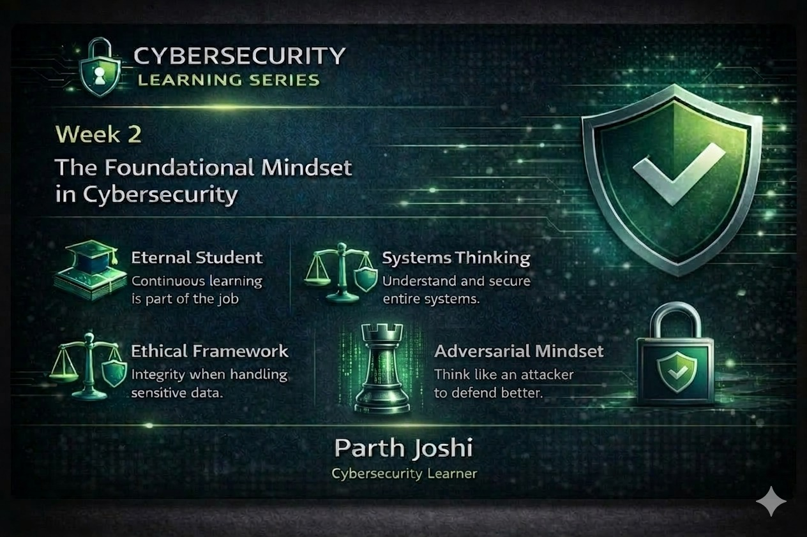
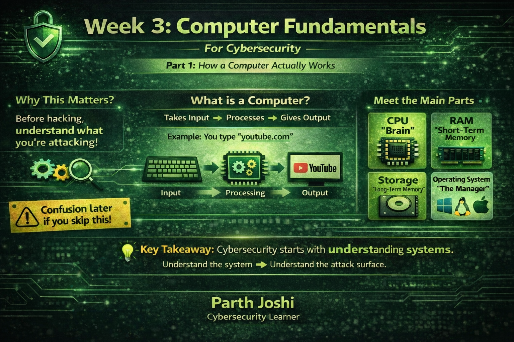
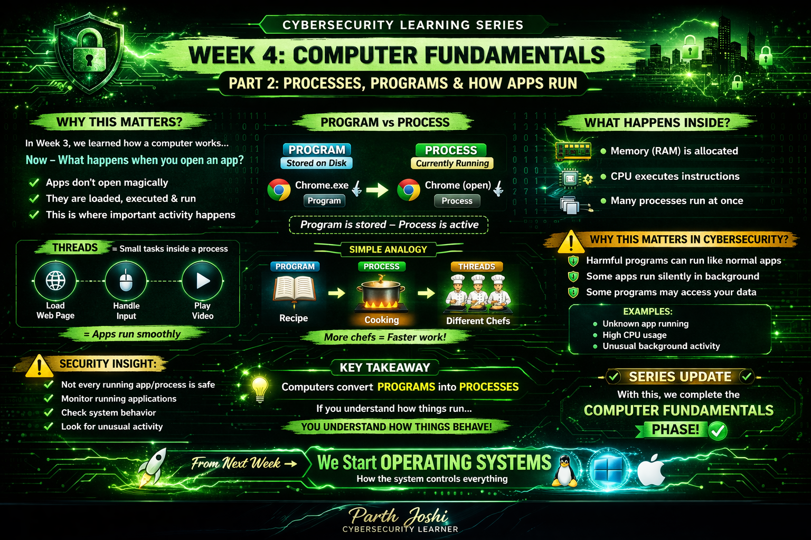

# Cybersecurity Learning Series

This repository documents my weekly cybersecurity learning journey.

Each week I explore new cybersecurity concepts and document what I learn.

---

Understanding what cybersecurity is, why it exists, and why protecting digital systems has become essential in today's world.

- [Week 1 – Introduction to Cybersecurity](weeks/week-1-introduction-to-cybersecurity.md)

---

Understanding the foundational mindset required to succeed in cybersecurity.

- [Week 2 – The Foundational Mindset in Cybersecurity](weeks/week-2-foundational-mindset-in-cybersecurity.md)

---

Understanding how a computer actually works — from CPU and memory to operating systems — and why this knowledge is essential before diving into cybersecurity.

* [Week 3 - Computer Fundamentals (Part 1)](weeks/week-3-computer-fundamentals-part-1.md)

---

Understanding how applications actually run — from programs to processes and threads — and why this knowledge is important in cybersecurity.

- [Week 4 - Computer Fundamentals (Part 2)](weeks/week-4-computer-fundamentals-part-2.md)

---

## Author

Parth Joshi  
Cybersecurity Learner
